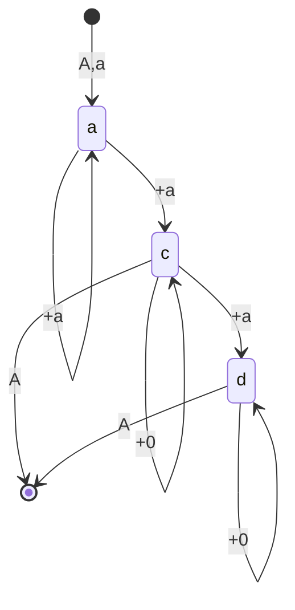

# Partition Aggregation

## Changes

* Wednesday, 22 February, 2022 
    - First Draft

## Algorithm

Consider a list of non negative real numbers. 


```python
data = [14, 1, 14, 9, 7, 6, 10, 6, 0, 0, 5, 10, 10, 11, 6, 10, 9]
```

We are going to develop efficient algorithm to split given list of non negative
real numbers to list of sublists, where sum of each sublist close to some
desired value. By close we mean a number called *distance*, which equals to
absolute value of difference between sum of sublist values and desired value.
For instance, for list `data` and `desired_value = 40` we may have next result. 


```python
desired_value = 40
partitions = [
    [14, 1, 14, 9],
    [7, 6, 10, 6, 0, 0, 5, 10],
    [10, 11, 6, 10],
    [9],
]
```

We will call each sublist -- partition, list of sublist -- partitions,
`sum(partition)` -- partition value. Terminology depends from application
domain. Another popular option is call each sublist -- chunk, list of sublist
-- chunks, `sum(chunk)` -- chunk value. 

Let's print sum and distance for every partition from above example. 

```python
for partition in partitions:
    print(
        f"{partition=},{sum(partition)=}, distance={abs(sum(partition) - desired_value)}"
    )
```
```output
partition=[14, 1, 14, 9],sum(partition)=38, distance=2
partition=[7, 6, 10, 6, 0, 0, 5, 10],sum(partition)=44, distance=4
partition=[10, 11, 6, 10],sum(partition)=37, distance=3
partition=[9],sum(partition)=9, distance=31
```


As we see all partitions except last are close to `40`, but last partition is
not. There is no more numbers in `data` to add to last partition to make last
partition more close to `40`. 

First we explain the algorithm with words and then will provide code. Let's
iterate over `data` and build first partition. We will join an element from
`data` into first partition until it is better to add the element into
partition than stop build first partition. Better means close to `40`. We
definitely must put `14` into 1-st partition `[14]`. Then we have a choice ,
add next element into current partition or say that first partition is ready
and start build second partition. To make the decision we compare distance of
current partition `[14]` with candidate partition `[14,1]`, where we join next
element from `data` to current partition. List `[14,1]` is more close to `40`
i.e. `abs(sum([14,1]) - 40) <= abs(sum([14]) - 40)`. Then we accept that
partition `[14,1]` is better then `[14]` and consider next candidate
`[14,1,14]`. It better then `[14,1]`. Then we consider `[14,1,14,9]`, it is
better than `[14,1,14]`. But `[14,1,14,9,7]` is not better than `[14,1,14,9]`
because partition `[14,1,14,9]` more close to `40` than candidate partition
`[14,1,14,9,7]`. Similarly we build second partition as `[7, 6, 10, 6, 0, 0, 5,
10]`, 3-rd partition as `[10,11,6,10]`, 4-rd partition as `[9]`. Now we write
algorithm with python code. 


```python
from numbers import Real


def distance(v1: Real, v2: Real) -> Real:
    "Returns distance between two values."
    return abs(v1 - v2)


def aggregate(items: list[Real], desired_value) -> list[list[Real]]:
    """Split list into list of sublists, where sum of each sublist close to `desired_volume`"""
    partitions = []
    current = None
    for item in items:
        if current is None:
            current = [item]
            continue
        candidate = current + [item]
        if distance(sum(candidate), desired_value) <= distance(
            sum(current), desired_value
        ):
            current = candidate
        else:
            partitions.append(current)
            current = [item]
    if current != None:
        partitions.append(current)
    return partitions
```

Let's test it with our `data`


```python
partitions = aggregate(data, desired_value)
for partition in partitions:
    print( f"{partition=},{sum(partition)=}, distance={abs(sum(partition) - desired_value)}")
```
```output
partition=[14, 1, 14, 9],sum(partition)=38, distance=2
partition=[7, 6, 10, 6, 0, 0, 5, 10],sum(partition)=44, distance=4
partition=[10, 11, 6, 10],sum(partition)=37, distance=3
partition=[9],sum(partition)=9, distance=31
```

In words, we iterate over `items`, every time we have `current` partition and
`candidate` partition , which is `current + [item]`. We accept candidate
partition as current until distance between `candidate` and `desired_value`
less or equal with distance between `current` and `desired_value`. It is
important accept candidate as current until it is less **or equal**. It allow
always join items with value 0 to candidate. Other words it is greedy
algorithms. This property is very important to many real applications. In
general, we like to avoid partition `[0]` if it possible. However current
version of `aggregate` function still allow get partition `[0]` in case where
possible to avoid this.


```python
partitions = aggregate([0, 120], desired_value)
for partition in partitions:
    print(
        f"{partition=},{sum(partition)=}, distance={abs(sum(partition) - desired_value)}"
    )
```
```output
partition=[0],sum(partition)=0, distance=40
partition=[120],sum(partition)=120, distance=80
```


This happened because distance between `0` and `40` less than distance between
`120` and `40`. We will a bit improve our algorithm on that way, if
`sum(current) == 0` we accept candidate. 


```python
def aggregate(items: list[Real], desired_value) -> list[list[Real]]:
    "Split list into sublists, where sum of each sublist close to `desired_volume`"
    partitions = []
    current = None
    for item in items:
        if current is None:
            current = [item]
            continue
        candidate = current + [item]
        if sum(current) == 0 or distance(
            sum(candidate), desired_value
        ) <= distance(sum(current), desired_value):
            current = candidate
        else:
            partitions.append(current)
            current = [item]
    if current != None:
        partitions.append(current)
    return partitions
```


```python
partitions = aggregate([0, 120], desired_value)
for partition in partitions:
    print(
        f"{partition=},{sum(partition)=}, distance={abs(sum(partition) - desired_value)}"
    )
```
```output
partition=[0, 120],sum(partition)=120, distance=80
```

## Alalysis

Now we will analyze range of a distance between a partition and desired value.
But before let make some assumptions about input list of values. Let denote
`desired_value` as $d$. Then let make an assumption that every value of element
$x$ of input list lies in $0 \le x \le m$, where $m \gt 0$. Let denote `current`
partition value as $A$ and current item value as $a$. So distance between
current partition value and desired value is $|A - d|$; distance between
candidate partition and desired value is $|A + a - d|$. Let assume that our
input data is infinite sequence. Let input sequence has infinite
many values $x \ge \epsilon$, where $\epsilon \gt 0$, other words $\exists n \in
N$, for which $n \epsilon > d$. Finally we make an assumption which
significantly simplify our analysis , we assume that $m \le d$. 

In this new notation we can describe algorithm as 

0. A = next(data), a = next(data)
1. If $| A + a - d | \le | A - d |$ 
    - A = A + a, a = next(data) 
2. Else $| A + a - d | \gt | A - d |$
    - Accept A
    - A, a = next(data),next(data) 
3. Go to step 1.

Depends of value $A$ and $a$ we distinguish 4 cases which allow us resolve
absolute value brackets. 

- a) $A + a \le d$, $A \le d$
- b) $A + a \le d$, $A \gt d$ , impossible, $A \gt d => A + a \gt d$
- c) $A + a \gt d$, $A \le d$
- d) $A + a \gt d$, $A \gt d$

And we need also initial state which we have after execute step 0.
- o) `A = next(data)`, `a = next(data)`

Now we can draw possible transitions between cases **a)**,**b)**,**c)**,**d)**;
our start state is **o)**.




Where notation means: 
- **+a**: `A = A + a`, `a = next(data)`
- **+0**: `A = A + 0`, `a = next(data)`
- **A, a**: Pass `A,a` to next state
- **A**: accept `A`


Now let's analyze cases **a)**,**b)**,**c)**,**d)** for step **1.** or **2.**.
It is convenient denote **a.1)** the case **a)** on step **1.** , similarly
**a.2)** means case **a)** on step **2.** etc.

Out goal estimate distance $|A - d|$ for step **2.**, because on step **2.** we
accept partition. But we also need estimate distance $|A + a -d|$ for step
**1.**, because we can move from one case **x)** on step **1.** to another case
**y)** on step **2.** and for **y.2)** there is no enough information to
estimate distance $|A - d|$, but we can use estimate $|A + a - d|$ from step
**x.1)**, because we made an assignment $A = A + a$ during transition `x -> y`.


**a.1)** Case **a)** is  $A + a \le d$, $A \le d$. According to **a)** we can
resolve inequality **1.** as

$$
\begin{align*}
| A + a - d| &\le | A - d |; \\
d - A - a &\le d - A; \\
a &\ge 0. 
\end{align*}
$$ 

It is identity. Other words we join items to current partition while **a)**
satisfied.

**a.2)** Inequality **2.** is negation of identity **a.1)** which is $a \lt 0$
-- that is impossible. That means there is no arrow to accept partition,
instead we have to move to other case.

**c.1)** Case **c)** is $A + a \gt d$, $A \le d$. According to **c)** we can
resolve inequality **1.** as


$$
\begin{align*}
|A + a -d | &\le | A - d |; \\ 
A + a - d &\le d - A; \\ 
a &\le 2d - 2A; \\
\frac{1}{2}a &\le d - A.
\end{align*}
$$

Let's estimate distance. 

$$
\begin{align*}
\max(|A + a - d|) &= \max(A + a - d) = \max(a - (d - A)) \le\\
&\le a - \frac{1}{2}a = \frac{1}{2}a \le \frac{1}{2}m
\end{align*}
$$

therefore 

$$
\begin{equation}
\max(|A + a - d|) \le \frac{1}{2}m
\end{equation}
$$

**c.2)** We accept partition A. Inequality **2.** is negation of **1.**, which is

$$
\begin{equation*}
\frac{1}{2}a \gt d - a
\end{equation*}
$$

Let's estimate distance 

$$
\begin{align*}
\max(|A - d|) &= \max(d-a) \lt \\
              &\lt \frac{1}{2}a \le \frac{1}{2}m
\end{align*}
$$

thus

$$
\begin{equation}
\max(|A-d|) \lt \frac{1}{2}m
\end{equation}
$$


**d.1)** Case **d)** is $A + a \gt d$, $A \gt d$. According to **d)**
we can resolve inequality **1.** as 

$$
\begin{align*}
    | A + a - d | &\le | A - d | \\
      A + a - d &\le A - d \\
      a \le 0
\end{align*}
$$

It means join only items with value 0. 

**d.2)** We accept partition A.Inequality **2.** is negation of inequality
**1.**, which is
   
$$ a \gt 0 $$

It is identity. Thus we have to use estimate $|A + a -d |$ for incoming cases **c.1)**.

Estimate of **c.1** after replace $A = A +a$ is
    
$$
\begin{equation}
\max(|A - d|) \le \frac{1}{2}m
\end{equation}
$$


We accept partition value A on **c.2** and **d.2**. On **c.2** $A \le d$ -- underflow, 
on **d.2** $A \gt d$ -- overflow. This implies

$$
\begin{equation}
      d - \frac{1}{2}m \lt A \le d + \frac{1}{2}m
\end{equation}
$$

We also note that with our assumptions it is the best estimate. It means
equality holds in the right part $A \le d + \frac{1}{2}m$ . For the left part
$d - \frac{1}{2}m \lt A$, the difference between $A$ and $d - \frac{1}{2}m$ can
be made arbitrarily small. Indeed, let's $A=d - \frac{1}{2}m$ and $a=m$. We have 
$|A + a - d | = \frac{1}{2}m \le |A-d| = \frac{1}{2}m$. Equality holds, this is case **c)**, we will assign $A = A + a$
and go on case **d)** and then go to finish with $A=d + \frac{1}{2}m$. 
This proved that equality holds for right part. 
Now let's 
$A = d - \frac{1}{2}m + \epsilon$ and $a=m$. Then 
$|A + a - d | = \frac{1}{2}m + \epsilon \gt | A - d | = \frac{1}{2}m - \epsilon$ , and we accept 
partition with value $A = d - \frac{1}{2}m + \epsilon$. This proved that 
the difference between $A$ and $d - \frac{1}{2}m$ can be made arbitrary small.


## Partition abstraction example

For analysis we have used list of real numbers as input. For real applications
each element of input list has a value and may have some info. In next example
info is `batch_num` and we renamed value to `volume`. In this example
`batch_num` is a number of loading data, and `volume` is number of loaded rows
for the batch. We aggregate batch numbers into partition as a list, like we did
for numbers.

### Example 1


```python
from dataclasses import dataclass


@dataclass
class Batch:
    batch_num: int
    volume: int


@dataclass
class Partition:
    batch_nums: list[int]
    volume: int = 0

    def __add__(self, other: "Partition") -> "Partition":
        return Partition(
            self.batch_nums + other.batch_nums,
            self.volume + other.volume,
        )


def create_partition(batch: Batch) -> Partition:
    return Partition([batch.batch_num], batch.volume)


def aggregate_partition(
    batches: list[Batch], desired_volume
) -> list[Partition]:
    "Split list into sublists, where sum of each sublist close to `desired_volume`"
    partitions = []
    current = None
    for batch in batches:
        if current is None:
            current = create_partition(batch)
            continue
        candidate = current + create_partition(batch)
        if current.volume == 0 or distance(
            candidate.volume, desired_volume
        ) <= distance(current.volume, desired_volume):
            current = candidate

        else:
            partitions.append(current)
            current = create_partition(batch)
    if current != None:
        partitions.append(current)
    return partitions

```


```python
desired_volume = 40
batches = [Batch(batch_num=i, volume=x) for i, x in enumerate(data)]
partitions = aggregate_partition(batches, desired_volume)

for partition in partitions:
    print(
        f"{partition=},{partition.volume=}, distance={abs(partition.volume - desired_value)}"
    )
```
```output
partition=Partition(batch_nums=[0, 1, 2, 3], volume=38),partition.volume=38, distance=2
partition=Partition(batch_nums=[4, 5, 6, 7, 8, 9, 10, 11], volume=44),partition.volume=44, distance=4
partition=Partition(batch_nums=[12, 13, 14, 15], volume=37),partition.volume=37, distance=3
partition=Partition(batch_nums=[16], volume=9),partition.volume=9, distance=31
```


We can call list of `Batch` as list of small partitions, and output list of
`Partition` as list of big partitions. Or in chunk terminology list of small
chunks and list of big chunks. Other words we aggregate list of something which
has a value into list of bigger something which has a value. 


Suppose batches are already ordered, and for an application it is enough to
remember only start batch number and stop batch number instead to remember list
of all batches in a partition. Here is an example. 

### Example 2


```python
@dataclass
class Partition:
    batch_num_from: int
    batch_num_to: int
    volume: int = 0

    def __add__(self, other: "Partition") -> "Partition":
        return Partition(
            self.batch_num_from,
            other.batch_num_to,
            self.volume + other.volume,
        )


def create_partition(batch: Batch) -> Partition:
    return Partition(batch.batch_num, batch.batch_num, batch.volume)
```


```python
partitions = aggregate_partition(batches, desired_volume)
for partition in partitions:
    print( f"{partition=},distance = {abs(partition.volume - desired_value)}")
```
```output
partition=Partition(batch_num_from=0, batch_num_to=3, volume=38),distance = 2
partition=Partition(batch_num_from=4, batch_num_to=11, volume=44),distance = 4
partition=Partition(batch_num_from=12, batch_num_to=15, volume=37),distance = 3
partition=Partition(batch_num_from=16, batch_num_to=16, volume=9),distance = 31
```


In general, info usually integer or string or date or range of integers or
range of strings or range of dates. We can aggregate info of input items into a
partition as a list as we did in **Example 1**. Or when items is ordered we can
aggregate info of input items into a range as we did in **Exmple 2**. Often for
an application value is an integer and desired value is an integer. But it is
also acceptable to have value is an integer and desired value is a real. 


 ## Conclusion
 
We have represented algorithm for aggregate list of small partitions into list
of big partitions with desired value $d$. If value $x$ of small partition 
$0 \le x \le m \le d$, then the value of big partition $A$ for non last partition 
$d - \frac{1}{2}m \lt A \le d + \frac{1}{2}m$. In particular if $m = d$ then 
$d - \frac{1}{2}d \lt A \le d + \frac{1}{2}d$. Last partition may have less 
accurate value.

The algorithm can be called as  "a half -- one and a half".


